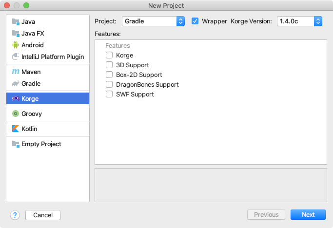

## IntelliJ Korge plugin



Download from JetBrains plugin repository:

* <https://plugins.jetbrains.com/plugin/9676-korge>

Download from releases:

* <https://github.com/korlibs/korge-intellij-plugin/releases>

### Building

```
./gradlew buildPlugin
```

Output: `build/distributions/KorgePlugin.zip`

### Executing from Source

```
./gradlew runIde
```

This should launch a new intelliJ Community Edition with the KorGE plugin.
You can open this project with IDEA and launch the `runIde` task via debugger
to be able to debug the plugin. 

### Trying the Tiled Editor

```
./gradlew runDebugTilemap
```
